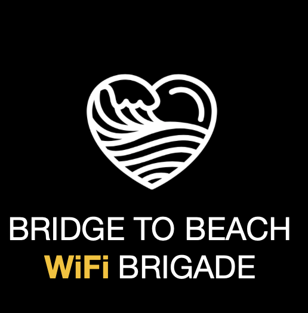

Each year tens of thousands of people run, walk and bike seven miles through the center
of San Francisco as part of the annual BART to Beach race. The race is joyful and absurd, just like San Francisco.

This year, the BART to Beach organizers are creating a brigade of volunteers to help be our eyes and ears on the ground during the event. The safety of the participants is the upmost importance to us and we want to make sure everyone has the resources they need in case of an incident. If you love BART to Beach as much as we do, please consider applying to be part of the brigade.

## So What is The Brigade exactly?

The Brigade is a group of volunteer BART to Beach participants and bystanders who will send in periodic reports over text about the event during the course of the day. They will need to go through a short training program before the event on basic safety procedures. **We will not be looking for you to handle any incidents, we just want you to know how to report them.**

There will be two types of brigade members based on what kind of data connectivity they can expect to have on the day of the event. Cellular service can be inconsistent during BART to Beach so we want to guarantee that some of our brigade members will be able to communicate with us regardless of cell networks.

### The WiFi Brigade
<figure>
	
</figure>

The WiFi Brigade will be composed of residents and business personnel who can guarantee that they will have wifi connectivity on the day of the race.

## The Walkie Brigade

The Walkie Brigade will be composed of event partipates.

The Brigade is a group of volunteers who will send in updates about the
* shifts
* sober
* training
* why would you do this?
* age limits

## How to Sign Up

We are looking for volunteers to staff two different brigades.

## FAQ

text text text ....
