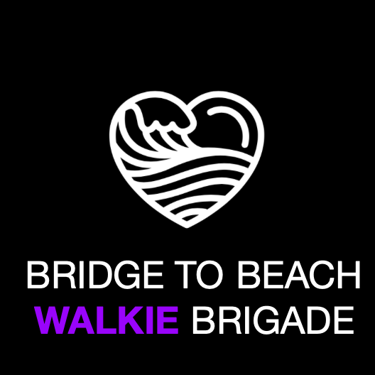

Each year tens of thousands of people run, walk and bike seven miles through the center
of San Francisco as part of the annual Bridge to Beach race. The race is joyful, absurd and loud -- just like Bay City.

As the organizers of Bridge to Beach, we are committed to preserving the culture of the event. But the safety of the participants is also of upmost importance. So this year, we are creating a brigade of volunteers to help be our eyes and ears on the ground during the event. We want to make sure we can provide help to all participants if they need it, but we can't be everywhere at once.

If you love Bridge to Beach as much as we do, please consider applying to be part of The Brigade.

## So What is The Brigade exactly?

The Brigade is a group of volunteer Bridge to Beach participants and bystanders who will send in periodic reports over text about the event during the course of the day. They will need to go through a short training program before the event on basic safety procedures. **We will not be looking for you to handle any incidents, we just want you to know how to report them.**

There will be two types of brigade members based on what kind of data connectivity they can expect to have on the day of the event. Cellular service can be inconsistent during Bridge to Beach so we want to guarantee that some of our brigade members will be able to communicate with us regardless of cell networks.

### The WiFi Brigade
<figure>
	
</figure>

The WiFi Brigade will be composed of residents and business personnel who can guarantee that they will have wifi connectivity on the day of the race.

## The Walkie Brigade

The Walkie Brigade will be composed of people walking or running in the event. They will either carry cell phones or walkie talkies to send in reports.

The Brigade is a group of volunteers who will send in updates about the

## How to Apply

To apply, please fill out form. We will be chatting briefly with all the
applicants so please include either a phone number or email address.

## FAQ

* **Will I be able to drink if I am a brigade member?**

We ask that all our brigade members refrain from drinking during the event. But please feel free to celebrate afterwards!

* **Are there any age limits?**

We are primarily looking for brigade members who are over 16, but if you are younger than that and want to participate, please reach out.

* **What does the training look like?**
....

* **What's in it for me?**
....
